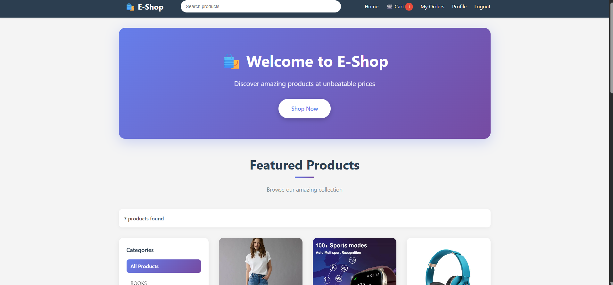
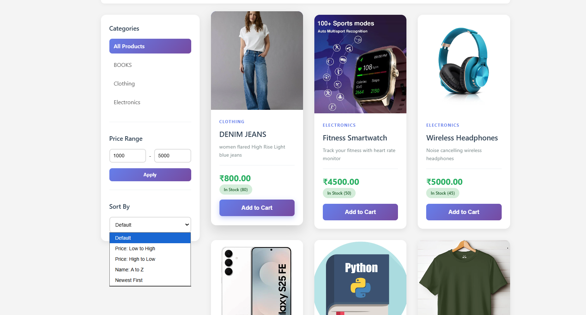
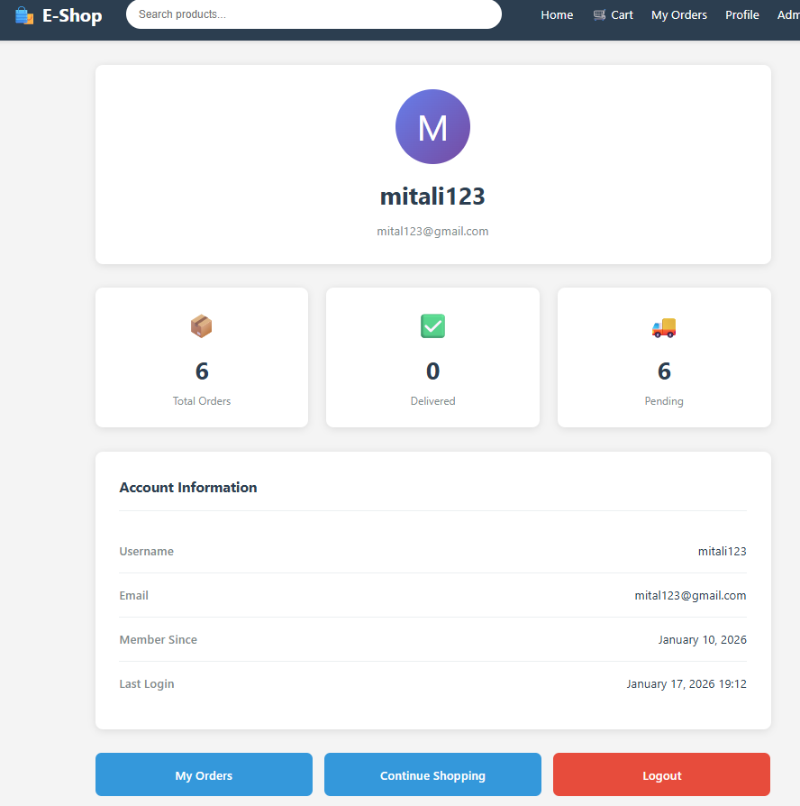

# 🛍️ E-Commerce Platform

A full-stack e-commerce web application built with Django, featuring a complete shopping experience with cart management, user authentication, advanced search & filters, and order processing.


## 🎯 Project Overview

This is a fully functional e-commerce platform that allows users to browse products, add items to their cart, and complete purchases. Built as a learning project to demonstrate full-stack web development skills.
## 📸 Screenshots

### Homepage - Hero Section & Product Grid


### Product Detail Page


### Shopping Cart


###  checklist


### User Profile


## ✨ Features

### Core Functionality
- 🛒 **Shopping Cart System** - Session-based cart with real-time updates
- 🔍 **Advanced Search** - Search products by name and description
- 🎛️ **Smart Filters** - Filter by category, price range, and sort options
- 📦 **Order Management** - Complete order lifecycle from checkout to tracking
- 🔐 **User Authentication** - Secure signup, login, and profile management
- 👤 **User Dashboard** - View order history and profile information

### User Experience
- 🎨 **Modern UI/UX** - Gradient themes with smooth animations
- 📱 **Fully Responsive** - Mobile-first design approach
- ⚡ **Real-time Updates** - Dynamic cart count and success messages
- 🏷️ **Category Management** - Organized product categorization

### Admin Features
- 📊 **Admin Panel** - Built-in Django admin for product management
- 📈 **Inventory Tracking** - Stock management and availability status
- 🛠️ **CRUD Operations** - Complete product and order management

## 🛠️ Tech Stack

**Backend:**
- Python 3.12
- Django 5.2.5
- SQLite (Development)
- Django ORM

**Frontend:**
- HTML5
- CSS3 (Grid, Flexbox, Animations)
- JavaScript (Vanilla)

**Key Concepts:**
- MVC Architecture
- Session Management
- User Authentication & Authorization
- Database Relationships (ForeignKey, OneToOne)
- Form Validation
- Template Inheritance

## 📂 Project Structure

```
ecommerce-platform/
├── cart/                   # Shopping cart functionality
│   ├── cart.py            # Cart logic and session handling
│   ├── views.py           # Cart views (add, remove, detail)
│   └── urls.py            # Cart URL patterns
├── orders/                # Order processing
│   ├── models.py          # Order and OrderItem models
│   ├── views.py           # Checkout and order views
│   ├── forms.py           # Order form
│   └── admin.py           # Order admin configuration
├── products/              # Product catalog
│   ├── models.py          # Product, Category, Review models
│   ├── views.py           # Product listing and detail views
│   └── admin.py           # Product admin configuration
├── users/                 # User authentication
│   ├── views.py           # Login, signup, profile views
│   ├── forms.py           # User forms
│   └── urls.py            # User URL patterns
├── templates/             # HTML templates
│   ├── base.html          # Base template with navbar
│   ├── products/          # Product templates
│   ├── cart/              # Cart templates
│   ├── orders/            # Order templates
│   └── users/             # User authentication templates
├── static/                # Static files (CSS, JS, images)
├── media/                 # User-uploaded content
└── manage.py              # Django management script
```

## 🚀 Installation & Setup

### Prerequisites
- Python 3.12+
- pip
- Git

### Step 1: Clone the Repository

```bash
git clone https://github.com/YOUR-USERNAME/ecommerce-platform.git
cd ecommerce-platform
```

### Step 2: Create Virtual Environment

```bash
# Windows
python -m venv venv
venv\Scripts\activate

# macOS/Linux
python3 -m venv venv
source venv/bin/activate
```

### Step 3: Install Dependencies

```bash
pip install django pillow
```

### Step 4: Run Migrations

```bash
python manage.py migrate
```

### Step 5: Create Superuser

```bash
python manage.py createsuperuser
# Follow prompts to create admin account
```

### Step 6: Run Development Server

```bash
python manage.py runserver
```

### Step 7: Access the Application

- **Website:** http://127.0.0.1:8000
- **Admin Panel:** http://127.0.0.1:8000/admin

## 📖 Usage

### For Users:
1. Browse products on the homepage
2. Use search bar or filters to find products
3. Click on a product to view details
4. Add products to cart
5. Proceed to checkout
6. Create an account or login
7. Complete order with delivery details
8. View order history in "My Orders"

### For Admins:
1. Login to admin panel
2. Add/Edit/Delete products
3. Manage categories
4. View and update orders
5. Manage user accounts

## 💡 Key Learning Outcomes

Through building this project, I gained hands-on experience with:

- **Django Framework:** MVT architecture, ORM, template system
- **Database Design:** Modeling relationships, foreign keys, migrations
- **Authentication:** User registration, login, permissions
- **Session Management:** Cart storage without database overhead
- **Form Handling:** Validation, error handling, CSRF protection
- **Responsive Design:** CSS Grid, Flexbox, mobile-first approach
- **Git & Version Control:** Commits, branching, collaboration

## 🎯 Technical Highlights

### Session-Based Cart
Implemented efficient cart system using Django sessions instead of database storage, improving performance and reducing query overhead.

### Advanced Filtering
Used Django Q objects to enable complex queries combining multiple filters (category, price range, search terms).

### Security
- CSRF protection on all forms
- User authentication required for checkout
- Password hashing with Django's built-in system
- SQL injection prevention through ORM

## 🔄 Latest Updates

- ✅ Fixed cart functionality (January 2025)
- ✅ Implemented advanced search & filters
- ✅ Added user authentication system
- ✅ Completed order management
- ✅ Added user profile dashboard
- ✅ All features tested and working

## 🚧 Future Enhancements

- [ ] Payment gateway integration (Razorpay/Stripe)
- [ ] Product reviews and ratings system
- [ ] Wishlist functionality
- [ ] Email notifications for orders
- [ ] Order tracking with real-time updates
- [ ] Discount coupons and promotional codes
- [ ] Product recommendation engine
- [ ] Multi-image product gallery
- [ ] Export orders to PDF
- [ ] Analytics dashboard

## 🐛 Known Issues

None currently. All core features are working as expected.

## 📝 License

This project is open source and available under the [MIT License](LICENSE).

## 👨‍💻 Developer

**[Mitali Das]**

- GitHub: [@your-username](https://github.com/mitalidas125/ecommerce-platform)
- LinkedIn: [Your Profile](https://linkedin.com/in/mitali-das-086718321
)
- Email: dasmitali7089@gmail.com

## 🙏 Acknowledgments

- Django documentation for comprehensive guides
- Stack Overflow community for troubleshooting help
- Inspiration from modern e-commerce platforms

## 📊 Project Stats

- **Lines of Code:** 2000+
- **Django Apps:** 4
- **Database Models:** 8
- **Templates:** 15+
- **Development Time:** 3 weeks
- **Last Updated:** January 2025

---

⭐ If you found this project helpful or interesting, please consider giving it a star!

💬 Questions or suggestions? Feel free to open an issue or reach out!

🚀 Happy Coding!